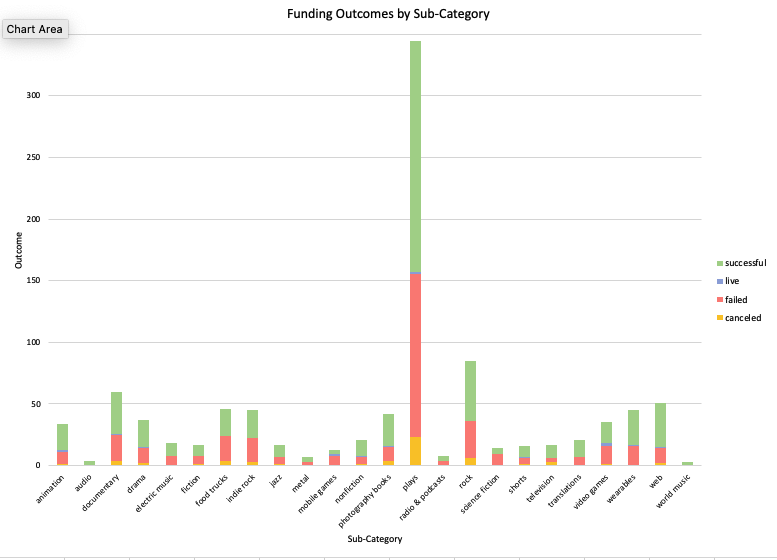

# Crowdfunding Campaign Success Analysis
**Creator**: Angelina Murdock  
**Date**: December 2024

## Overview
This project explores a dataset of 1,000 crowdfunding campaigns to identify key factors that influence a project's success. Using **Microsoft Excel**, the analysis focuses on cleaning and organizing data, performing trend analysis, and building interactive visualizations. The goal is to help campaign creators understand what contributes to a successful campaign by examining variables such as funding goals, campaign duration, category, and number of backers.

## Table of contents
- [Overview](#overview)
- [Features](#features)
- [Installation](#installation)
- [Analysis](#analysis)
- [Resources](#resources)

## Features
- **Interactive PivotTables and Charts** to explore trends by category, goal size, and campaign outcome

- **Calculated Campaign Duration** using Excel date formulas

- **Conditional Formatting** to highlight successful campaigns

- **Success Rate Visualizations** to compare categories and outcomes

- Organized data tabs for easy navigation and filtering

## Installation
### Requirements
- Microsoft Excel (2016 or later recommended)

### Set up
- Download or clone the repository
- Open the `CrowdfundingBook.xlsx` file
- Navigate to the Dashboard or PivotTable tabs to explore visualizations

### Usage instructions
- Use filters on PivotTables to explore different categories, outcomes, and funding levels
- Charts and graphs will update dynamically based on selections
- Navigate between sheets for raw data, summary statistics, and visual dashboards

## Analysis
### Key Insights
- Successful campaigns outnumber failed ones across most categories. The only exception is the Food category, where failed campaigns were more common.
- The Theater category had both the highest number of total campaigns and the highest number of successful campaigns.
- July recorded the highest number of successful campaigns among all months.

### Statistical Summary
- **Median over mean:** Due to skewed data and outliers, the median is a more reliable summary statistic than the mean.
- **More variability in successful campaigns**: Successful campaigns showed a wider range in number of backers and pledged amounts, indicating more extreme outcomes, which explains their higher variability.

### Limitations
- **Outliers**: Many campaigns have extremely high numbers of backers or pledged amounts, which can skew average values.
- **Uneven sample sizes**: Some categories are overrepresented, so generalizing results across all categories should be done cautiously.

### Charts

## Resources
- **DU Bootcamp Module 1:** Used challenge files and class materials from the bootcamp.
- **ChatGPT:** Assisted with code explanations and debugging.
